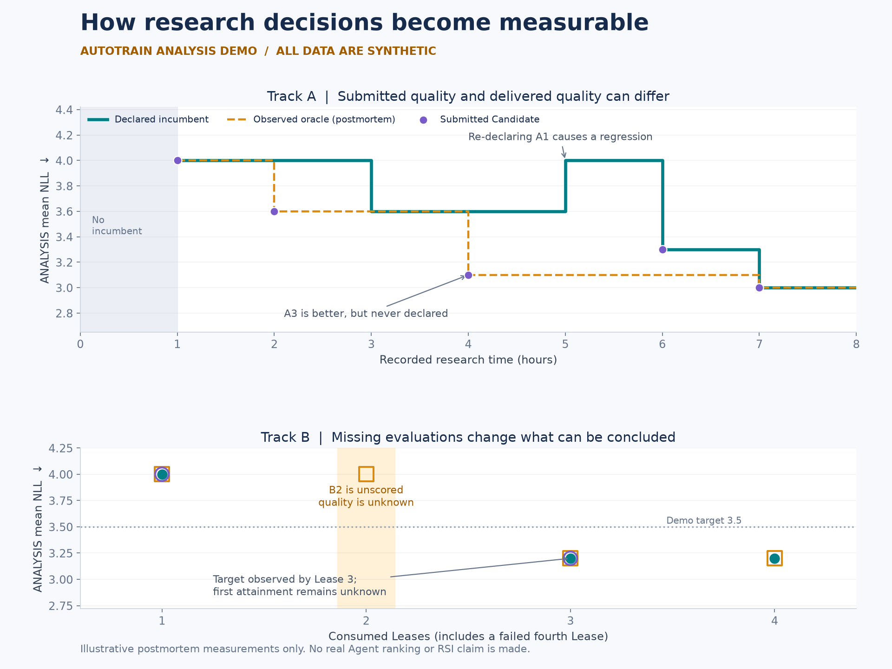

# AutoTrain Visualization and Analysis Skill

A portable static dashboard, an English analysis skill, and a reproducible worked example for AutoTrain-Bench results. Run the website locally without a GitHub account, token, backend, or frontend package installation. GitHub hosting is optional.

## Run locally

Requirements: Python 3.9+ for the dashboard. Clone or download this repository, then run:

```sh
git clone https://github.com/xiehuanyi/autotrain-bench-viz.git
cd autotrain-bench-viz
python3 tools/build_rsi.py --output-dir dist
python3 -m http.server 8000 --bind 127.0.0.1 --directory dist
```

Open **http://127.0.0.1:8000/?lang=en**. Stop the server with Ctrl+C. The generated `dist/index.html` embeds its data and translations and can also be opened directly without a server. Copy the entire `dist/` directory when sharing the static site, including its downloadable JSON.

The dashboard includes model filters, configurable axes, linear/log scales, Candidate ANALYSIS trajectories, final TEST results, detailed point tooltips, and paired Track A/B tables. Its initial view is final TEST score versus seconds per task. Use the language switch or `?lang=en` / `?lang=zh`; switching languages preserves chart selections.

The committed data contains 24 completed H200 preview runs: 11 A8, 11 B6, and two B12 extensions (Fable 5.1 and Astra). B12 is the initial view; budget configurations remain separate in charts, with an additional B6/B12 comparison table. The B12 challenge manifest differs only by its added budget configuration; task, data, evaluator and Core identities are retained.

The data is the H200 preview campaign. It is not the synthetic worked example below and is not a formal leaderboard. The dashboard shows submitted-Candidate observations; it does not implement the analysis skill's complete incumbent/oracle reconstruction or input-admission checks.

## English analysis skill

The [autotrain-analysis skill](skills/autotrain-analysis/SKILL.md) follows Liangyu Wang's [research-dynamics design](https://github.com/liangyuwang/AutoTrain-Bench/blob/811d6a559270e4b4ea838aba1224dc330b62fb97/docs/research-dynamics.md). It covers:

- Input admission, historical result compatibility, provenance, and coverage.
- Submitted, incumbent, and observed-oracle curves, with distinct Track A/B budgets.
- Target attainment, missing-data handling, selection gaps, and serving cost.
- Process evidence for improvements and reuse, with explicit limits on RSI claims.

To install, copy the **entire** `skills/autotrain-analysis/` directory into your Codex skills directory (`$CODEX_HOME/skills`, or `~/.codex/skills` by default). Keep its `references/` and `agents/` subdirectories. If a skill with that name is already installed, compare it before replacing it.

Then ask:

> Use $autotrain-analysis to analyze completed episodes in my AutoTrain project and produce an auditable English report.

The skill is a workflow, not a bundled production `bench_analysis` package. It can guide an agent in writing the read-only analysis needed for a task. It does not launch training or rerun hidden evaluations.

## Worked demo

Read the [English demo report](examples/research-dynamics/report/report.md) or inspect the [numerical results](examples/research-dynamics/report/analysis.json). **Every number and process note in this example is synthetic.** It demonstrates an undeclared better Candidate, a regression, repeated declarations, missing evaluation, and ambiguous first attainment.



The [source fixture](examples/research-dynamics/fixtures/demo.json), configuration, computation script, CSV, evidence records, and figures are included. To regenerate with Python 3.12+:

```sh
python3 -m venv .venv
.venv/bin/python -m pip install -r requirements-demo.txt
.venv/bin/python examples/research-dynamics/build_demo.py
```

On Windows, use `.venv\Scripts\python.exe` instead of `.venv/bin/python`. Matplotlib is needed only to regenerate these figures; reading the example or running the website needs no installation. The demo script accepts only its invented schema and is not a real-episode loader.

## Rebuild or adapt the dashboard

```sh
# Reproduce the committed root pages from public aggregates:
python3 tools/build_rsi.py

# Build a separate static directory:
python3 tools/build_rsi.py --output-dir dist

# Export a compatible trusted viewer snapshot to a separate directory:
python3 tools/build_rsi.py --snapshot /path/to/viewer/data.json --output-dir dist
```

The exporter selects numeric results, model identifiers, Candidate history, and public metadata. It checks selected data/evaluator identity fields for completed runs; this is not the full admission or comparison validation in the skill. Raw transcripts, commands, workspace text, and credentials are not included in the exported fields. Review publication permissions and the generated aggregate before hosting it.

The current dashboard template and exporter describe the included single-H200 campaign, including its known model list, budgets, and editorial notes. For another campaign, adapt the exporter, model definitions, narrative, and translations together instead of presenting the old explanatory text as findings about new runs. See [the code and data guide](docs/project-layout.md).

## Optional hosting

Any static host can serve `dist/`. You can keep using it locally without enabling GitHub Pages.

For your own GitHub site, see [deployment instructions](docs/deployment.md). An [inactive, manual Pages workflow template](deploy/github-pages.yml.example) is included. Enable it only in a repository you control; it uses that repository's automatically issued `GITHUB_TOKEN`. No maintainer credentials are distributed or required.

The original repository's [existing hosted preview](https://xiehuanyi.github.io/autotrain-bench-viz/) is a separate deployment choice. Cloning the code does not configure hosting for your account.

## Interpretation

A and B both allow adaptation and use different budgets. ANALYSIS is postmortem measurement, never feedback delivered during research. Candidate count, improving curves, and A/B differences do not establish a causal RSI effect. Keep final TEST quality, Candidate serving cost, research expenditure, and coverage distinct.
